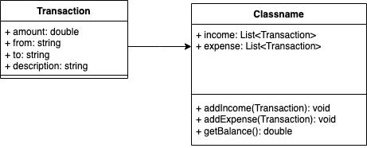

# Transaction Tracker

A simple transaction tracker built with the Dart programming language to help you manage personal budgets by recording income and expenses for individual accounts and displaying current balances.

## Features
Add Income: Record income transactions for any account.
Add Expense: Log expense transactions and automatically update the account's balance.
Display Balance: View the current balance for each account.
Error Handling: Handles insufficient balance during expense transactions.

## Running the Program

After running the program, you will be presented with a menu of options:

* Press 1 to enter an income.
* Press 2 to enter an expense.
* Press 3 to view the current balance.
* Press 4 to exit the program.

## Language Features

* Switch
* Object oriented programming concept: Classes

## Program Flowchart

## Class Diagram

