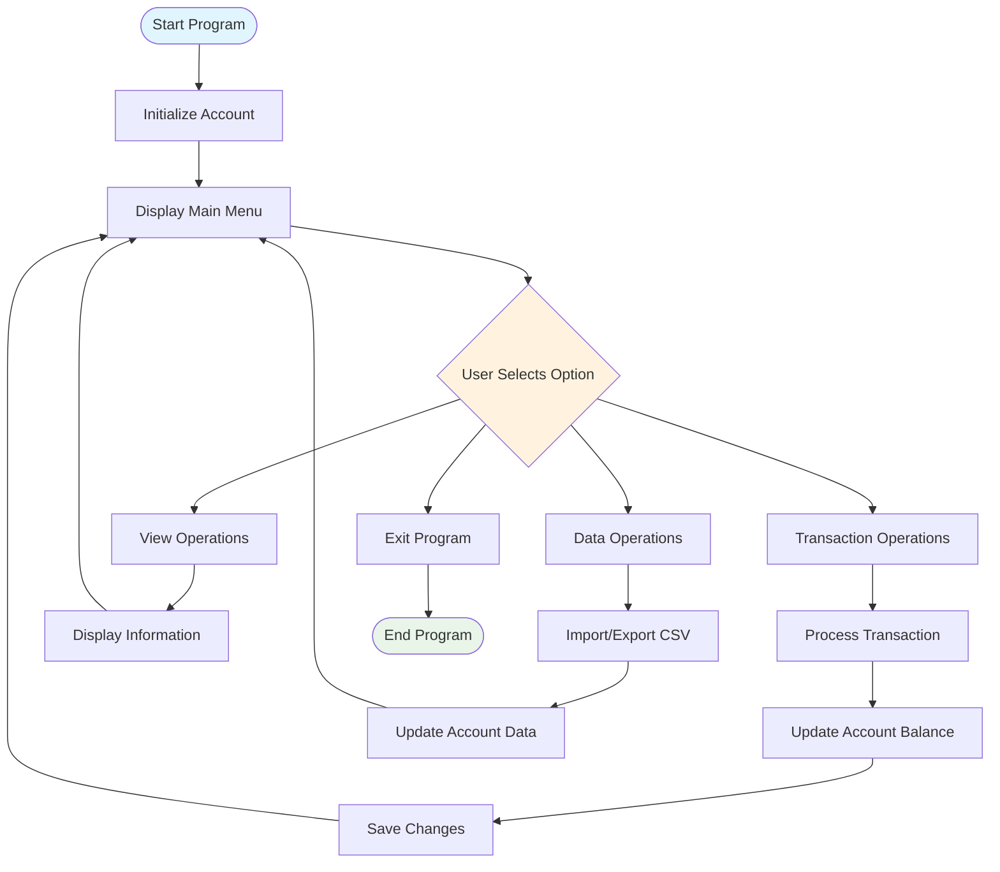
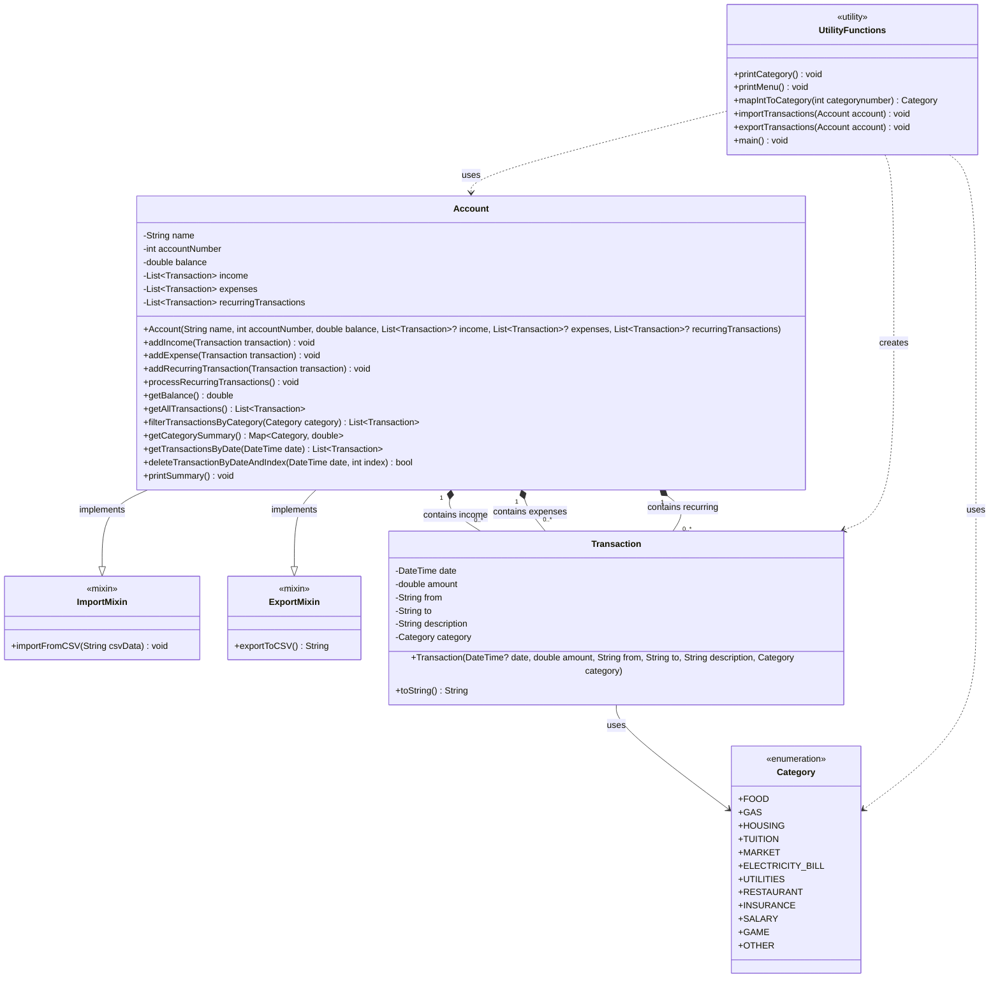

## Transaction tracker flowchart



## Transaction tracker UML diagram


## Dart's Features Applied in Application

**1. Enums**

**Reason for usage**: enum `Category` to define a fixed set of transaction categories with type safety and prevent invalid category. This enum is useful for transaction filtering by category.

**Implementation**:

```
enum Category {
  food,
  gas,
  housing,
  tuition,
  market,
  electricity_bill,
  utilities,
  restaurant,
  insurance,
  salary,
  game,
  other,
}
```

**2. Mixins**
   
**Reason for usage**: To provide modular functionality for CSV import/export operations that can be mixed into classes without inheritance constraints.

**Implementation**:

Define the `ImportMixin` and `ExportMixin` mixin with instances and methods for importing and exporting functions.

```
mixin ImportMixin {
  void importFromCSV(String csvData) {
    // CSV import logic
  }
}

mixin ExportMixin {
  String exportToCSV() {
    // CSV export logic
  }
}
```
Apply the mixins into the `Account` class
```
class Account with ImportMixin, ExportMixin {
  // Account implementation
}
```
**3. Switch Statements**

**Reason for usage:** To handle multiple conditional branches efficiently, especially for menu options and category mapping.

**Implementation:**

`Switch` for category mapping

```
Category mapIntToCategory(int categorynumber) {
  final categoryEnum;
  switch (categorynumber) {
    case 1:
      categoryEnum = Category.food;
      break;
    case 2:
      categoryEnum = Category.gas;
      break;
    // ... more cases
    default:
      categoryEnum = Category.other;
  }
  return categoryEnum;
}
```
`Switch` for menu options

```
switch (option) {
      case "1":
        stdout.write("Enter income amount: ");
        ...        
          ),
        );

        print("Income added successfully!");
        break;

      case "2":
        stdout.write("Enter expense amount: ");
        ...
          ),
        );
      // ... more cases

      default:
        print("Invalid option, please try again.");
}
```
`Switch` for recurrence types

```
    switch (type) {
      case RecurrenceType.daily:
      ...
      case RecurrenceType.weekly:
      ...

      case RecurrenceType.monthly:
      ...

      case RecurrenceType.yearly:
      ...
    }
  }
```
**4. Exception Handling**

**Reason for usage:** `try-catch` blocks and `throw Exception()` are used for insufficient balance protection, CSV import/export error handling

**Implementation:**

Error handling when the account does not have enough money to addExpense

```
void addExpense(Transaction transaction) {
  if (balance >= transaction.amount) {
    expenses.add(transaction);
    balance -= transaction.amount;
  } else {
    throw Exception('Insufficient balance!');
  }
}

try {
  account.addExpense(transaction);
  print("Expense added successfully!");
} catch (e) {
  print(e);
}
```

`try-catch` block for CSV import/Export error handling 

```
void importTransactions(Account account) {
  try {
    stdout.write("Enter CSV file path to load: ");
    ...
    print("Transactions imported from CSV successfully!");
  } catch (e) {
    print("Failed to import transactions: $e");
  }
}

void exportTransactions(Account account) {
  try {
    stdout.write("Enter output file path to save CSV: ");
    ...
    print("Transactions exported to CSV successfully!");
  } catch (e) {
    print("Failed to export transactions: $e");
  }
}
```
**5. Higher-Order Functions (where, fold, forEach)**

**Reason for Usage:** To perform functional programming operations on collections efficiently and reduce codes implemented.

```
// where() for filtering
List<Transaction> filterTransactionsByCategory(Category category) {
  return getAllTransactions()
      .where((transaction) => transaction.category == category)
      .toList();
}

// fold() for aggregation
print('Total Income: ${income.fold(0.0, (sum, t) => sum + t.amount)}');

// forEach() for iteration
categorySummary.forEach((category, total) {
  print("Category: $category, Total: $total");
});
```
**6.  Named Parameters with Default Values**

**Reason for Usage:** To make constructors more readable for Transaction and Account classes,  and allow optional parameters with default values.

```
Transaction({
  DateTime? date,
  this.amount = 0.0,
  this.from = 'None',
  this.to = 'None',
  this.description = 'None',
  this.category = Category.other,
}) : date = date ?? DateTime.now();

```
**7. Null Safety**

**Reason for Usage:** Prevents null pointer exceptions throughout the financial application

**Implementation:** 

```
// Nullable types
DateTime? date
List<Transaction>? income

// Null-aware operators
date = date ?? DateTime.now();
final filePath = stdin.readLineSync()!;
```
**8. Spread Operator (...)**

**Reason for Usage:** To combine multiple lists into a single list efficiently.

**Implementation:** 
```
List<Transaction> getAllTransactions() => [
  ...income,
  ...expenses,
];
```
**9. Method Overriding**
**Reason for Usage:** To provide custom string representation for Transaction objects.

**Implementation:**
```
@override
String toString() {
  return 'Date: ${date.toLocal()} | Amount: $amount | From: $from | To: $to | Description: $description | Category: $category';
}
```
