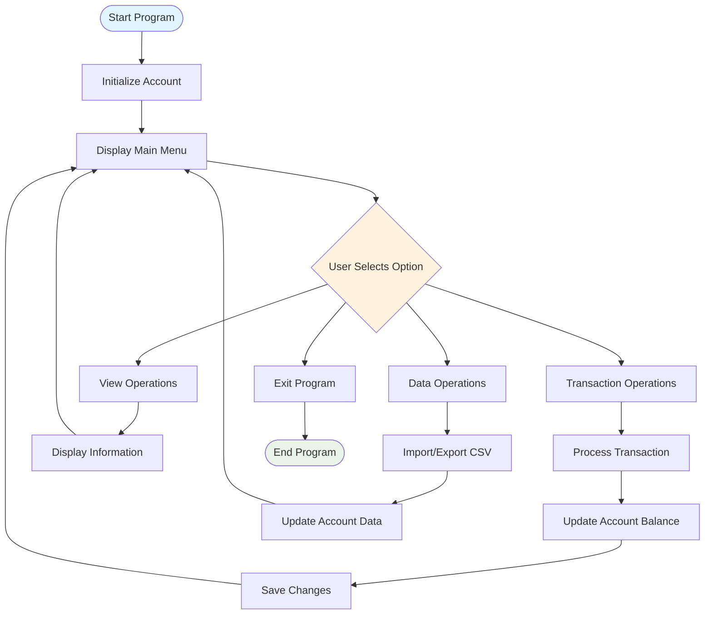

```mermaid
flowchart TD
    A([Start Program])
    
    A --> B[Initialize Account]
    
    B --> C[Display Main Menu]
    
    C --> D{User Selects Option}
    
    D --> E[Transaction Operations]
    
    E --> F[Process Transaction]
    
    F --> G[Update Account Balance]
    
    G --> H[Save Changes]
    
    H --> C
    
    D --> I[View Operations]
    
    I --> J[Display Information]
    
    J --> C
    
    D --> K[Data Operations]
    
    K --> L[Import/Export CSV]
    
    L --> M[Update Account Data]
    
    M --> C
    
    D --> N[Exit Program]
    
    N --> O([End Program])
    
    style A fill:#e1f5fe
    style D fill:#fff3e0
    style O fill:#e8f5e8
```